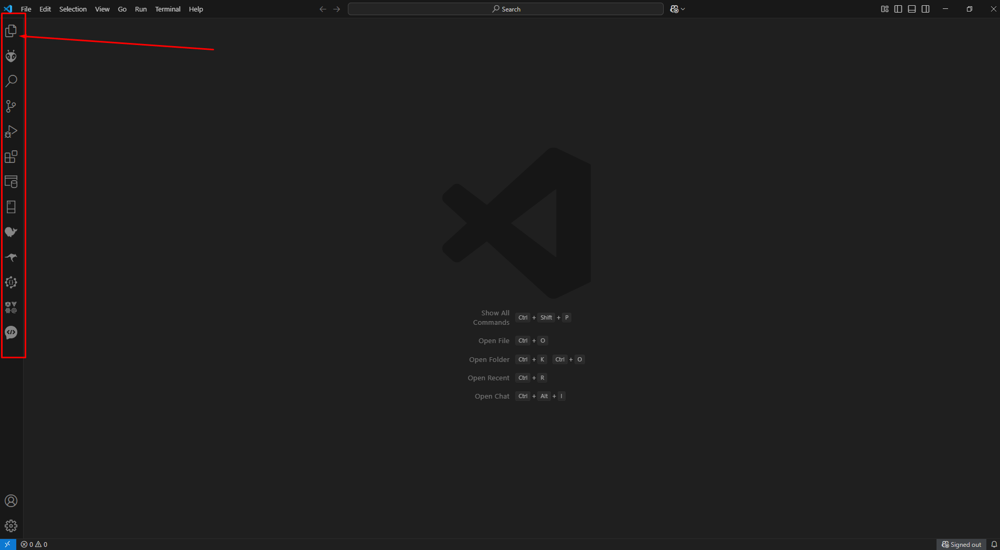
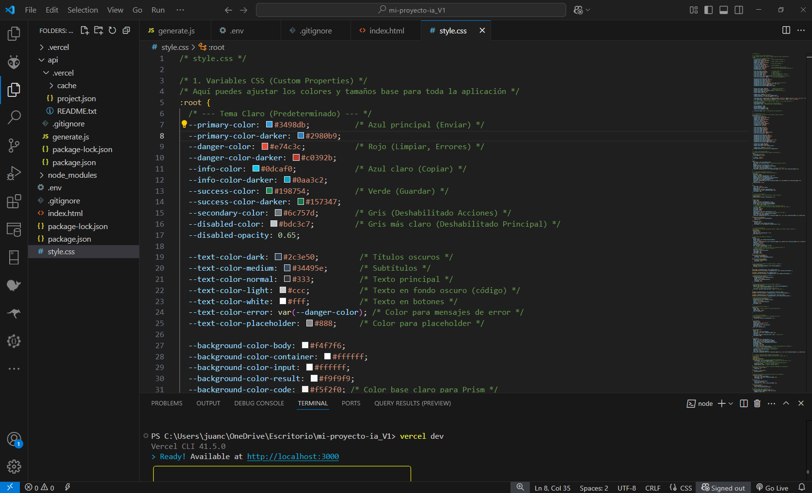
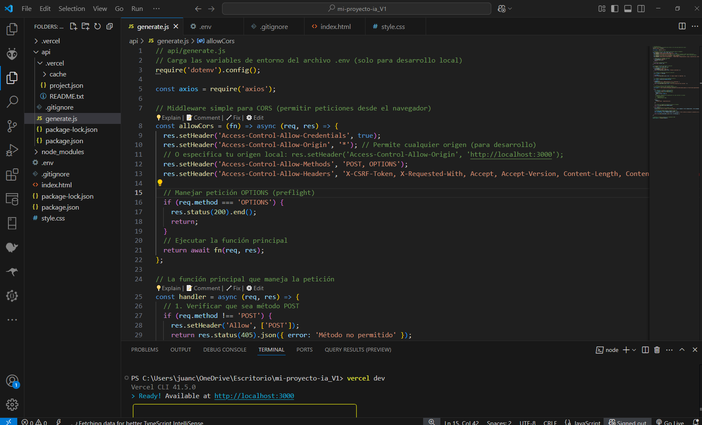
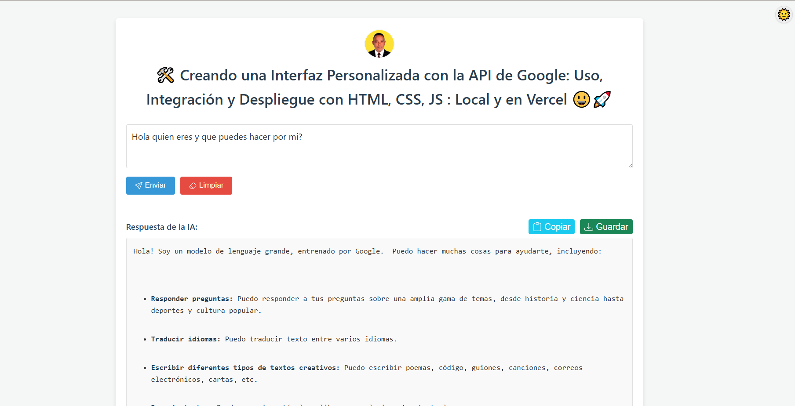
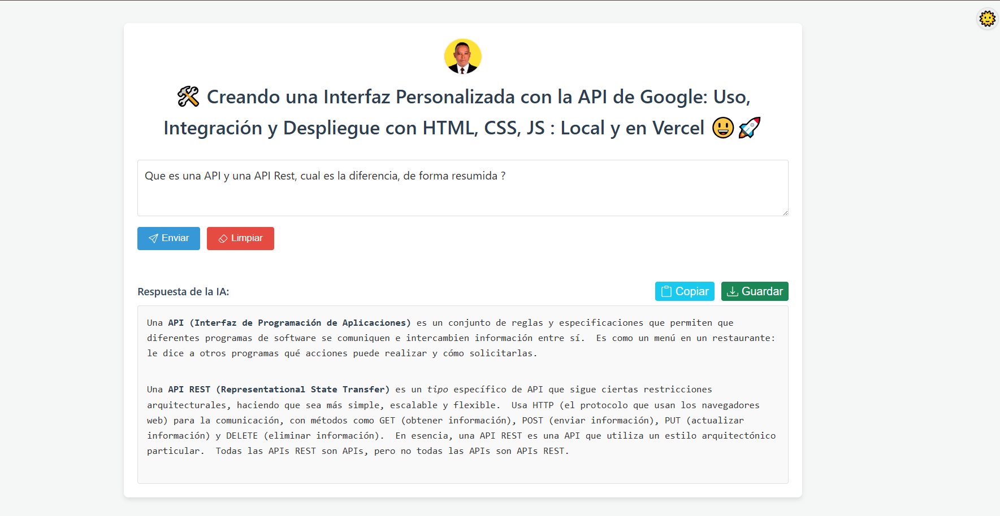
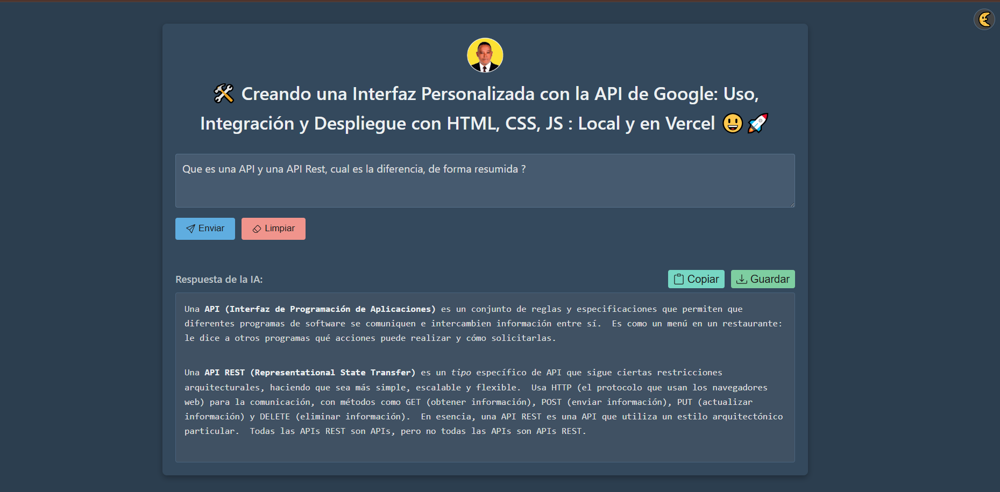
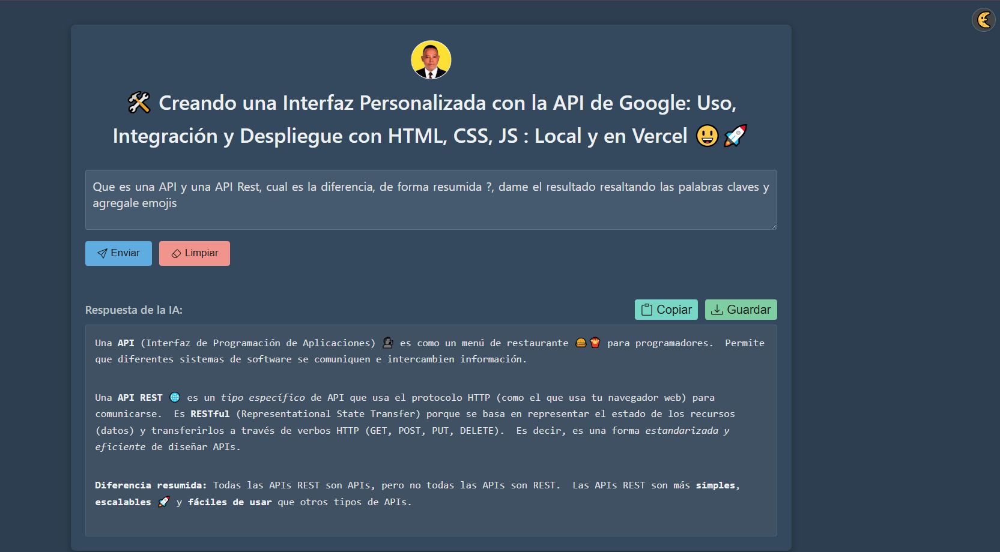

# 🚀 Simple Gemini AI Web App (Guía de Configuración Local)--
## 🛠️ Creando una Interfaz Personalizada con la API de Google: Uso, Integración y Despliegue con HTML, CSS, JS : Local y en Vercel 😃🚀

Esta es una aplicación web básica que permite a los usuarios enviar consultas a la **API de Google Gemini** y ver las respuestas. Utiliza un frontend simple (HTML, CSS, JS) y un backend serverless (Node.js) que se ejecuta localmente simulando el entorno de Vercel con `vercel dev`.

## 📋 Prerrequisitos

Antes de comenzar, asegúrate de tener instalado lo siguiente:

1. **Node.js y npm:** Necesarios para ejecutar JavaScript en el backend, gestionar paquetes y usar Vercel CLI. Verifica tu instalación abriendo tu terminal y ejecutando:
   ```bash
   node -v
   npm -v
   ```
   Si no los tienes, descárgalos desde [nodejs.org](https://nodejs.org/) (se recomienda la versión LTS).

2. **Vercel CLI:** La herramienta de línea de comandos de Vercel. Instálala globalmente e inicia sesión:
   ```bash
   npm install -g vercel
   vercel login
   ```
   Sigue las instrucciones para autenticarte (generalmente a través del navegador).

3. **Google Gemini API Key:** Necesitas una clave API para usar Gemini. Puedes obtenerla desde [Google AI Studio](https://aistudio.google.com/) o la consola de Google Cloud. Asegúrate de que la API esté habilitada para tu proyecto.

4. **Un Editor de Código:** Como [Visual Studio Code](https://code.visualstudio.com/), Sublime Text, etc. En Nuestro Caso usaremos el VISUAL STUDIO CODE:


5. **Git (Opcional pero recomendado):** Si planeas usar GitHub.

## 🛠️ Herramientas Esenciales a Instalar

Instala estas herramientas iniciales y esenciales en tu computadora **ANTES** de empezar a crear los archivos del proyecto:

### 💻 PASO 1: Instalar Visual Studio Code (VS Code)

**¿Qué es?** Es el programa donde escribirás y editarás todo el código (HTML, CSS, JavaScript).

**¿Dónde conseguirlo?** Ve al sitio web oficial: https://code.visualstudio.com/

**Pasos de Instalación:**

1. Abre el enlace en tu navegador.
2. La página detectará automáticamente tu sistema operativo. Haz clic en el botón grande de descarga.
3. Se descargará un archivo instalador.
4. Ejecuta ese archivo.
5. En el asistente de instalación:
   - Acepta el acuerdo de licencia.
   - Elige la carpeta de instalación (la ubicación por defecto suele estar bien).
   - En "Tareas Adicionales", asegúrate de marcar "Agregar al PATH" (**importante**).
   - Haz clic en "Instalar".
6. ¡Listo! Ahora puedes buscar "Visual Studio Code" en tu menú de inicio y abrirlo.


## VISUAL STUDIO DESCARGAR E INSTALAR- VAMOS AL ENLACE:


## LE DAMOS A ESTA OPCION DE WINDOWS O EL SISTEMA QUE TENGAMOS:


## PANTALLA PRINCIPAL UNA VEZ HEMOS INSTALADO:




### ⚙️ PASO 2: Instalar Node.js y npm

**¿Qué es?** Node.js es el entorno que permite ejecutar JavaScript fuera del navegador. npm (Node Package Manager) viene incluido y se usa para instalar librerías.

**¿Dónde conseguirlo?** Ve al sitio web oficial: https://nodejs.org/

**Pasos de Instalación:**

1. Abre el enlace en tu navegador.
2. Elige la versión **LTS** (Long Term Support).
3. Ejecuta el archivo descargado.
4. En el asistente de instalación:
   - Acepta los términos de licencia.
   - Elige la carpeta de instalación.
   - Asegúrate de que la opción "Add to PATH" esté seleccionada (**crucial**).
   - Haz clic en "Instalar".
5. **Verificación Importante:**
   - Cierra TODOS los terminales abiertos.
   - Abre un NUEVO terminal.
   - Escribe `node -v` y presiona Enter.
   - Escribe `npm -v` y presiona Enter.
   - Si ves números de versión, ¡todo está correcto!
 
## NODE DESCARGAR E INSTALAR- VAMOS AL ENLACE:


## LE DAMOS A ESTA OPCION:


 
   

### 🔄 PASO 3: Instalar Vercel CLI

**¿Qué es?** Es la herramienta de línea de comandos de Vercel para ejecutar y desplegar tu proyecto.

**Pasos de Instalación:**

1. Abre un terminal.
2. Escribe el siguiente comando y presiona Enter:
   ```bash
   npm install -g vercel
   ```
3. Verifica la instalación:
   ```bash
   vercel --version
   ```
4. Iniciar Sesión:
   ```bash
   vercel login
   ```
5. Sigue las instrucciones para autorizar la conexión.

## 📁 Pasos de Configuración

Sigue estos pasos para configurar y ejecutar el proyecto en tu máquina local.

### 1. Crear la Carpeta del Proyecto

Crea una carpeta en tu computadora donde vivirá el proyecto. Abre tu terminal y usa:

```bash
# Elige una ubicación (ej. Escritorio)
cd ~/Desktop
# Crea la carpeta del proyecto
mkdir mi-proyecto-ia
# Entra en la carpeta
cd mi-proyecto-ia
```

### 2. Estructura de Archivos

Tu proyecto tendrá esta estructura:

```
mi-proyecto-ia/
├── api/
│   └── generate.js      <-- Archivo de la función serverless
├── .env                 <-- Archivo para la API Key (local)
├── .gitignore           <-- Archivo para ignorar archivos en Git/Vercel
├── index.html           <-- El frontend de la aplicación
├── style.css            <-- Estilos CSS para el frontend
└── package.json         <-- Se creará con npm init
```

Para crear esta estructura, dentro de la carpeta del proyecto ejecuta:

```bash
# Dentro de mi-proyecto-ia
mkdir api
touch index.html style.css .env .gitignore api/generate.js
```


Este archivo define la **estructura y el contenido** de la página web que el usuario ve e interactúa.

*   **Definición Estructural:** Establece la estructura básica del documento HTML (`<!DOCTYPE html>`, `<html>`, `<head>`, `<body>`).
*   **Metadatos y Enlaces:** Configura metadatos (`<meta>`), el título de la página (`<title>`), el ícono (`<link rel="shortcut icon">`), y enlaza hojas de estilo externas (`<link rel="stylesheet" href="style.css">`) y librerías CSS (Prism).
*   **Contenedor Principal:** Envuelve todo el contenido visible en un `<div class="container">` para facilitar el diseño y la organización.
*   **Interfaz de Usuario (UI):**
    *   **Botón de Tema:** Incluye un botón (`<button id="themeToggle">`) para cambiar entre modo claro y oscuro.
    *   **Título y Avatar:** Muestra el título principal (`<h1>`) y una imagen de avatar (``).
    *   **Área de Prompt:** Proporciona un campo de texto (`<textarea id="promptInput">`) para que el usuario ingrese su consulta.
    *   **Botones de Acción Principal:** Agrega botones para "Enviar" (`<button id="executeBtn">`) la consulta y "Limpiar" (`<button id="clearBtn">`) la interfaz, incluyendo iconos SVG.
    *   **Área de Resultados:** Define un encabezado (`<h3>`) y un contenedor (`<div id="resultBox">`) donde se mostrará la respuesta de la IA.
    *   **Botones de Acción de Resultado:** Incluye botones para "Copiar" (`<button id="copyBtn">`) y "Guardar" (`<button id="saveBtn">`) la respuesta, con iconos SVG.
*   **Indicador de Carga:** Añade un elemento visual (`<div id="loading">`) que se muestra mientras se espera la respuesta de la IA.
*   **Inclusión de Scripts:** Carga librerías JavaScript externas necesarias (`marked.min.js`, `prism-core.min.js`, `prism-autoloader.min.js`) al final del `<body>`.
*   **Script Principal:** Contiene el código JavaScript embebido (`<script>...</script>`) que maneja la lógica del frontend de la aplicación.


# 📄 Código del Archivo `index.html`


# 📄 Código del Archivo `index.html`

```html
<!DOCTYPE html>
<!-- Declara el tipo de documento como HTML5 -->
<html lang="es" data-theme="light">
<!-- Elemento raíz del HTML, define el idioma como español ('es') y establece un atributo 'data-theme' inicial como 'light' (para el tema claro/oscuro manejado por CSS/JS) -->

<head>
  <!-- Sección de metadatos y enlaces del documento, no visible directamente en la página -->
  <meta charset="UTF-8">
  <!-- Especifica la codificación de caracteres como UTF-8 (soporta la mayoría de los caracteres y símbolos) -->
  <link rel="shortcut icon" href="https://cdn-icons-png.flaticon.com/512/10306/10306029.png" type="image/x-icon">
  <!-- Enlace al icono (favicon) que aparece en la pestaña del navegador -->
  <meta name="viewport" content="width=device-width, initial-scale=1.0">
  <!-- Configura la vista en dispositivos móviles: el ancho de la página se ajusta al ancho del dispositivo y la escala inicial es 1.0 (sin zoom inicial) -->
  <title>Mi App con Gemini AI</title>
  <!-- Título que aparece en la pestaña o barra de título del navegador -->
  <link href="https://cdnjs.cloudflare.com/ajax/libs/prism/1.29.0/themes/prism.min.css" rel="stylesheet" />
  <!-- Enlace a la hoja de estilos de Prism.js (desde un CDN) para el resaltado de sintaxis de código (tema claro por defecto) -->
  <link rel="stylesheet" href="style.css">
  <!-- Enlace a la hoja de estilos personalizada ('style.css') que define la apariencia de la aplicación -->
</head>

<body>
  <!-- Contenido visible de la página web -->

  <div class="theme-toggle-container">
    <!-- Contenedor para el botón de cambio de tema (probablemente posicionado de forma absoluta con CSS) -->
    <button id="themeToggle" title="Cambiar modo claro/oscuro">🌞</button>
    <!-- Botón para cambiar entre el tema claro y oscuro. El 'id' permite seleccionarlo con JS. El 'title' es el texto que aparece al pasar el ratón (tooltip). El icono (emoji) se actualizará con JS -->
  </div>

  <div class="container">
    <!-- Contenedor principal que envuelve la mayoría del contenido de la aplicación, usado para centrar y limitar el ancho -->
    <div style="text-align: center;">
      <!-- Contenedor para centrar la imagen del avatar. Nota: Usar estilos en línea ('style=') generalmente se desaconseja; es mejor hacerlo en el archivo CSS. -->
      
        <!-- Muestra una imagen de avatar. 'src' es la fuente de la imagen, 'alt' es texto alternativo para accesibilidad. Estilos en línea definen tamaño y borde redondeado. -->
    </div>
    <h1>🛠️ Creando una Interfaz Personalizada con la API de Google: Uso, Integración y Despliegue con HTML, CSS, JS : Local y en Vercel 😃🚀</h1>
    <!-- Título principal de la aplicación -->

    <div class="prompt-section">
      <!-- Sección que contiene el área para ingresar la consulta (prompt) y los botones relacionados -->
      <textarea class="prompt-area" id="promptInput" placeholder="Escribe tu consulta aquí..."></textarea>
      <!-- Área de texto multilínea donde el usuario escribe su consulta. 'id' para JS, 'class' para CSS, 'placeholder' es el texto de ayuda que desaparece al escribir -->
      <div class="button-group">
        <!-- Contenedor para agrupar los botones principales (Enviar, Limpiar) -->
        <button id="executeBtn" title="Enviar consulta">
          <!-- Botón para enviar la consulta a la IA. 'id' para JS, 'title' es el tooltip -->
          <svg xmlns="http://www.w3.org/2000/svg" width="16" height="16" fill="currentColor" class="bi bi-send" viewBox="0 0 16 16">
            <!-- Icono SVG (Scalable Vector Graphics) incrustado directamente en el HTML, representa un avión de papel -->
            <path d="M15.854.146a.5.5 0 0 1 .11.54l-5.819 14.547a.75.75 0 0 1-1.329.124l-3.178-4.995L.643 7.184a.75.75 0 0 1 .124-1.33L15.314.037a.5.5 0 0 1 .54.11ZM6.636 10.07l2.761 4.338L14.13 2.576zm6.787-8.201L1.591 6.602l4.339 2.76z"/>
          </svg>
          Enviar <!-- Texto del botón -->
        </button>
        <button id="clearBtn" title="Limpiar consulta y resultado">
          <!-- Botón para limpiar el área de consulta y la caja de resultados. 'id' para JS, 'title' es el tooltip -->
            <svg xmlns="http://www.w3.org/2000/svg" width="16" height="16" fill="currentColor" class="bi bi-eraser" viewBox="0 0 16 16">
              <!-- Icono SVG incrustado, representa un borrador -->
              <path d="M8.086 2.207a2 2 0 0 1 2.828 0l3.879 3.879a2 2 0 0 1 0 2.828l-5.5 5.5A2 2 0 0 1 7.879 15H5.12a2 2 0 0 1-1.414-.586l-2.5-2.5a2 2 0 0 1 0-2.828zm2.121.707a1 1 0 0 0-1.414 0L4.16 7.547l5.293 5.293 4.633-4.633a1 1 0 0 0 0-1.414zM8.746 13.547 3.453 8.254 1.914 9.793a1 1 0 0 0 0 1.414l2.5 2.5a1 1 0 0 0 .707.293H7.88a1 1 0 0 0 .707-.293z"/>
            </svg>
          Limpiar <!-- Texto del botón -->
        </button>
      </div>
    </div>

    <div class="result-container">
      <!-- Sección que contiene el área donde se mostrará la respuesta de la IA -->
      <div class="result-header">
          <!-- Encabezado de la sección de resultados, contiene el título y los botones de acción -->
          <h3>Respuesta de la IA:</h3>
          <!-- Título indicando que esta es la respuesta de la IA -->
          <div class="result-actions">
              <!-- Contenedor para agrupar los botones de acción relacionados con el resultado (Copiar, Guardar) -->
              <button id="copyBtn" title="Copiar al portapapeles" disabled>
                <!-- Botón para copiar la respuesta al portapapeles. 'id' para JS, 'title' es el tooltip. El atributo 'disabled' lo deshabilita inicialmente hasta que haya un resultado -->
                <svg xmlns="http://www.w3.org/2000/svg" width="16" height="16" fill="currentColor" class="bi bi-clipboard" viewBox="0 0 16 16">
                  <!-- Icono SVG incrustado, representa un portapapeles -->
                  <path d="M4 1.5H3a2 2 0 0 0-2 2V14a2 2 0 0 0 2 2h10a2 2 0 0 0 2-2V3.5a2 2 0 0 0-2-2h-1v1h1a1 1 0 0 1 1 1V14a1 1 0 0 1-1 1H3a1 1 0 0 1-1-1V3.5a1 1 0 0 1 1-1h1z"/>
                  <path d="M9.5 1a.5.5 0 0 1 .5.5v1a.5.5 0 0 1-.5.5h-3a.5.5 0 0 1-.5-.5v-1a.5.5 0 0 1 .5-.5zm-3-1A1.5 1.5 0 0 0 5 1.5v1A1.5 1.5 0 0 0 6.5 4h3A1.5 1.5 0 0 0 11 2.5v-1A1.5 1.5 0 0 0 9.5 0z"/>
                </svg>
                Copiar <!-- Texto del botón -->
              </button>
              <button id="saveBtn" title="Guardar como .txt" disabled>
                <!-- Botón para guardar la respuesta como archivo .txt. 'id' para JS, 'title' es el tooltip. También deshabilitado inicialmente -->
                <svg xmlns="http://www.w3.org/2000/svg" width="16" height="16" fill="currentColor" class="bi bi-download" viewBox="0 0 16 16">
                  <!-- Icono SVG incrustado, representa una flecha de descarga -->
                  <path d="M.5 9.9a.5.5 0 0 1 .5.5v2.5a1 1 0 0 0 1 1h12a1 1 0 0 0 1-1v-2.5a.5.5 0 0 1 1 0v2.5a2 2 0 0 1-2 2H2a2 2 0 0 1-2-2v-2.5a.5.5 0 0 1 .5-.5"/>
                  <path d="M7.646 11.854a.5.5 0 0 0 .708 0l3-3a.5.5 0 0 0-.708-.708L8.5 10.293V1.5a.5.5 0 0 0-1 0v8.793L5.354 8.146a.5.5 0 1 0-.708.708z"/>
                </svg>
                Guardar <!-- Texto del botón -->
              </button>
          </div>
      </div>
      <div id="resultBox" class="result-box">Esperando consulta...</div>
      <!-- El contenedor ('div') donde se mostrará dinámicamente el texto de la respuesta de la IA. 'id' para JS, 'class' para CSS. El contenido inicial es 'Esperando consulta...' -->
    </div>
  </div>

  <div class="loading" id="loading" style="display: none;">
    <!-- Elemento que muestra un indicador de carga (spinner y texto). 'id' para JS, 'class' para CSS. El estilo en línea 'display: none;' lo oculta por defecto; JS lo mostrará cuando sea necesario -->
    <div class="spinner"></div>
    <!-- Elemento visual del spinner (probablemente animado con CSS) -->
    <span>Cargando...</span>
    <!-- Texto que acompaña al spinner -->
  </div>

  <!-- Carga de librerías JavaScript externas al final del body para asegurar que el DOM esté cargado antes de ejecutarlas -->
  <script src="https://cdn.jsdelivr.net/npm/marked/marked.min.js"></script>
  <!-- Carga la librería Marked.js (desde un CDN) para convertir texto en formato Markdown a HTML -->
  <script src="https://cdnjs.cloudflare.com/ajax/libs/prism/1.29.0/components/prism-core.min.js"></script>
  <!-- Carga el núcleo de la librería Prism.js (desde un CDN) para el resaltado de sintaxis -->
  <script src="https://cdnjs.cloudflare.com/ajax/libs/prism/1.29.0/plugins/autoloader/prism-autoloader.min.js"></script>
  <!-- Carga el plugin Autoloader de Prism.js, que permite cargar automáticamente las definiciones de lenguaje necesarias para el resaltado -->

  <script>
    // --- Inicio del bloque de script JavaScript ---
    // Este código maneja la lógica del lado del cliente (frontend):
    // - Obtener referencias a los elementos HTML.
    // - Manejar clics en botones (Enviar, Limpiar, Copiar, Guardar, Tema).
    // - Cambiar el tema (claro/oscuro) y guardar la preferencia.
    // - Enviar la consulta al backend (API).
    // - Mostrar la respuesta (formateada con Marked y Prism).
    // - Mostrar/ocultar el indicador de carga.
    // - Copiar texto al portapapeles.
    // - Guardar texto como archivo.

    // Referencias a elementos del DOM (obtener los elementos HTML por su 'id')
    const executeBtn = document.getElementById('executeBtn'); // Botón Enviar
    const clearBtn = document.getElementById('clearBtn');     // Botón Limpiar
    const promptInput = document.getElementById('promptInput'); // Área de texto para la consulta
    const resultBox = document.getElementById('resultBox');     // Div donde se muestra el resultado
    const loadingIndicator = document.getElementById('loading'); // Div del indicador de carga
    const copyBtn = document.getElementById('copyBtn');       // Botón Copiar
    const saveBtn = document.getElementById('saveBtn');       // Botón Guardar
    const themeToggleBtn = document.getElementById('themeToggle'); // Botón de cambio de tema

    // Estado inicial de los botones de acción (deshabilitados porque no hay resultado)
    copyBtn.disabled = true;
    saveBtn.disabled = true;

    // --- Funcionalidad del Tema ---
    // Obtener el tema guardado en localStorage, o usar 'light' si no hay nada guardado
    const currentTheme = localStorage.getItem('theme') || 'light';
    // Aplicar el tema al elemento <html> al cargar la página
    document.documentElement.setAttribute('data-theme', currentTheme);
    // Establecer el icono inicial del botón de tema según el tema actual
    themeToggleBtn.textContent = currentTheme === 'light' ? '🌞' : '🌜';

    // Añadir un 'escuchador' de eventos al botón de tema para que reaccione al clic
    themeToggleBtn.addEventListener('click', () => {
      // Determinar cuál será el próximo tema (si es 'light', cambiar a 'dark', y viceversa)
      let targetTheme = document.documentElement.getAttribute('data-theme') === 'light' ? 'dark' : 'light';
      // Aplicar el nuevo tema al elemento <html>
      document.documentElement.setAttribute('data-theme', targetTheme);
      // Guardar la nueva preferencia de tema en localStorage
      localStorage.setItem('theme', targetTheme);
      // Actualizar el icono del botón de tema
      themeToggleBtn.textContent = targetTheme === 'light' ? '🌞' : '🌜';
      // Opcional: Si se usaran diferentes temas de Prism para claro/oscuro, se llamarían aquí
      // updatePrismTheme(targetTheme);
    });

    // Opcional: Función para cambiar el CSS de Prism si es necesario (actualmente comentada)
    // function updatePrismTheme(theme) {
    //   const prismLink = document.querySelector('link[href*="prism"]');
    //   if (prismLink) {
    //     prismLink.href = theme === 'dark'
    //       ? 'https://cdnjs.cloudflare.com/ajax/libs/prism/1.29.0/themes/prism-tomorrow.min.css' // Tema oscuro de Prism
    //       : 'https://cdnjs.cloudflare.com/ajax/libs/prism/1.29.0/themes/prism.min.css';      // Tema claro de Prism
    //   }
    // }
    // updatePrismTheme(currentTheme); // Llamar al cargar la página si se usara la función anterior


    // --- Lógica Principal de la App ---
    // Añadir 'escuchadores' de eventos a los botones principales
    executeBtn.addEventListener('click', executeQuery);   // Al hacer clic en Enviar, llamar a executeQuery
    clearBtn.addEventListener('click', clearAll);       // Al hacer clic en Limpiar, llamar a clearAll
    copyBtn.addEventListener('click', copyToClipboard); // Al hacer clic en Copiar, llamar a copyToClipboard
    saveBtn.addEventListener('click', saveAsTextFile);  // Al hacer clic en Guardar, llamar a saveAsTextFile

    // Función asíncrona para ejecutar la consulta a la IA
    async function executeQuery() {
      const prompt = promptInput.value.trim(); // Obtener el texto del textarea y quitar espacios en blanco al inicio/fin
      // Si el prompt está vacío, mostrar notificación y salir
      if (!prompt) {
        showNotification('Por favor, escribe una consulta.');
        return;
      }
      // Mostrar indicador de carga, poner texto de "Procesando..." y deshabilitar botones de acción
      showLoading();
      resultBox.textContent = 'Procesando...';
      copyBtn.disabled = true;
      saveBtn.disabled = true;

      try {
        // Realizar la petición (fetch) al endpoint del backend '/api/generate'
        const response = await fetch('/api/generate', {
          method: 'POST', // Usar método POST
          headers: { 'Content-Type': 'application/json' }, // Indicar que el cuerpo es JSON
          body: JSON.stringify({ prompt: prompt }), // Enviar el prompt como un objeto JSON
        });

        // Si la respuesta del servidor no fue exitosa (ej. error 4xx o 5xx)
        if (!response.ok) {
          let errorMsg = 'Error al comunicarse con el servidor.';
          // Intentar leer el mensaje de error específico del JSON de la respuesta
          try {
            const errorData = await response.json();
            errorMsg = `Error ${response.status}: ${errorData.error || 'Detalles no disponibles.'}`;
          } catch (e) {
            // Si no se puede leer el JSON, usar el texto de estado HTTP
            errorMsg = `Error ${response.status}: ${response.statusText}`;
          }
          // Lanzar un error para que sea capturado por el bloque catch
          throw new Error(errorMsg);
        }

        // Si la respuesta fue exitosa, convertirla de JSON a objeto JavaScript
        const data = await response.json();

        // Validación robusta de la estructura de la respuesta de la API Gemini
        // Verificar si existe la estructura esperada: candidates -> content -> parts -> text
        if (data.candidates && data.candidates.length > 0 && data.candidates[0].content?.parts?.length > 0) {
          const contentPart = data.candidates[0].content.parts[0];
          if (contentPart.text) {
            // Si se encontró el texto, mostrarlo y habilitar botones de copiar/guardar
            displayResult(contentPart.text);
            copyBtn.disabled = false;
            saveBtn.disabled = false;
          } else {
            // Si la parte de contenido no tiene texto, mostrar advertencia y error
             console.warn('La parte de contenido no contiene texto:', contentPart);
             resultBox.innerHTML = '<span class="error-message">La respuesta no contiene texto legible.</span>';
             copyBtn.disabled = true;
             saveBtn.disabled = true;
          }
        } else {
          // Si la estructura de la respuesta no es la esperada, mostrar advertencia y error
          console.warn('Respuesta inesperada o vacía de la API:', data);
          resultBox.innerHTML = '<span class="error-message">No se recibió una respuesta válida del modelo.</span>';
          copyBtn.disabled = true;
          saveBtn.disabled = true;
        }
      } catch (error) {
        // Capturar cualquier error ocurrido durante el fetch o el procesamiento
        console.error('Error en executeQuery:', error); // Mostrar error detallado en la consola del navegador
        // Mostrar mensaje de error en la caja de resultados para el usuario
        resultBox.innerHTML = `<span class="error-message">Error: ${error.message}</span>`;
        // Permitir copiar/guardar el mensaje de error si se desea
        copyBtn.disabled = false;
        saveBtn.disabled = false;
      } finally {
        // Este bloque se ejecuta siempre, haya habido error o no
        hideLoading(); // Ocultar el indicador de carga
      }
    }

    // Función para mostrar el resultado formateado
    function displayResult(text) {
        // Usar marked.parse() para convertir el texto (posiblemente Markdown) a HTML
        resultBox.innerHTML = marked.parse(text);
        // Usar Prism.highlightAllUnder() para aplicar resaltado de sintaxis a los bloques de código (etiquetas <pre><code>) dentro de resultBox
        Prism.highlightAllUnder(resultBox);
    }

    // Función asíncrona para copiar el resultado al portapapeles
    async function copyToClipboard() {
      // Obtener solo el texto visible (sin formato HTML) de la caja de resultados
      const textToCopy = resultBox.innerText;
      // Si no hay texto o es el mensaje inicial/procesando, mostrar notificación y salir
      if (!textToCopy || resultBox.textContent === 'Esperando consulta...' || resultBox.textContent === 'Procesando...') {
        showNotification('No hay resultado para copiar.');
        return;
       }
      try {
          // Usar la API del Portapapeles del navegador para escribir el texto
          await navigator.clipboard.writeText(textToCopy);
          // Cambiar temporalmente el texto del botón a "¡Copiado!"
          const originalHTML = copyBtn.innerHTML; // Guardar el contenido original (SVG + texto)
          copyBtn.textContent = '¡Copiado!';     // Mostrar solo texto temporalmente
          copyBtn.disabled = true;              // Deshabilitar mientras muestra "Copiado"
          // Después de 1.5 segundos, restaurar el botón
          setTimeout(() => {
            copyBtn.innerHTML = originalHTML; // Restaurar SVG + texto
            copyBtn.disabled = false;        // Rehabilitar
          }, 1500);
      } catch (err) {
          // Si la copia falla (ej. permisos denegados), mostrar error en consola y notificación
          console.error('Error al copiar:', err);
          showNotification('No se pudo copiar el texto.');
      }
    }

    // Función para guardar el resultado como archivo .txt
    function saveAsTextFile() {
        // Obtener solo el texto visible de la caja de resultados
        const textToSave = resultBox.innerText;
        // Si no hay texto o es el mensaje inicial/procesando, mostrar notificación y salir
        if (!textToSave || resultBox.textContent === 'Esperando consulta...' || resultBox.textContent === 'Procesando...') {
          showNotification('No hay resultado para guardar.');
          return;
        }
        try {
            // Crear un Blob (objeto binario grande) con el texto, especificando tipo y codificación
            const blob = new Blob([textToSave], { type: 'text/plain;charset=utf-8' });
            // Crear una URL temporal para el Blob
            const url = URL.createObjectURL(blob);
            // Crear un elemento de enlace (<a>) invisible
            const anchor = document.createElement('a');
            anchor.href = url; // Establecer la URL del Blob en el enlace
            // Crear un nombre de archivo descriptivo con la fecha actual
            const timestamp = new Date().toISOString().slice(0, 10); // Formato YYYY-MM-DD
            anchor.download = `gemini-respuesta-${timestamp}.txt`; // Sugerir este nombre de archivo para la descarga
            // Añadir el enlace al cuerpo del documento (necesario para Firefox)
            document.body.appendChild(anchor);
            // Simular un clic en el enlace para iniciar la descarga
            anchor.click();
            // Quitar el enlace del cuerpo del documento
            document.body.removeChild(anchor);
            // Liberar la URL del Blob para liberar memoria
            URL.revokeObjectURL(url);
        } catch (error) {
            // Si ocurre un error durante la creación/descarga del archivo
            console.error('Error al guardar archivo:', error);
            showNotification('Ocurrió un error al intentar guardar el archivo.');
        }
    }

    // Función para mostrar el indicador de carga y deshabilitar botones
    function showLoading() {
      loadingIndicator.style.display = 'flex'; // Mostrar el div de carga (usa flex para centrar)
      executeBtn.disabled = true;             // Deshabilitar botón Enviar
      clearBtn.disabled = true;               // Deshabilitar botón Limpiar
    }

    // Función para ocultar el indicador de carga y habilitar botones
    function hideLoading() {
      loadingIndicator.style.display = 'none'; // Ocultar el div de carga
      executeBtn.disabled = false;            // Habilitar botón Enviar
      clearBtn.disabled = false;              // Habilitar botón Limpiar
    }

    // Función para limpiar el área de consulta y resultados
    function clearAll() {
      promptInput.value = ''; // Vaciar el textarea
      resultBox.innerHTML = 'Esperando consulta...'; // Restaurar el mensaje inicial en la caja de resultados
      copyBtn.disabled = true; // Deshabilitar botón Copiar
      saveBtn.disabled = true; // Deshabilitar botón Guardar
    }

    // Función simple para mostrar notificaciones (actualmente usa 'alert')
    function showNotification(message) {
        // Se podría reemplazar 'alert' por una implementación más elegante
        // (ej. un pequeño mensaje que aparece y desaparece en la esquina)
        alert(message);
    }

  </script>
  <!-- Fin del bloque de script JavaScript -->
</body>
<!-- Fin del contenido visible -->

</html>
<!-- Fin del documento HTML -->

```

## 📋 Estructura del Documento

Este archivo HTML crea una interfaz de usuario simple para interactuar con la API de Google Gemini. Incluye:

### 🧩 Componentes Principales

1. **Contenedor Principal**
   - Título de la aplicación
   - Sección para ingresar prompts
   - Sección para mostrar resultados

2. **Sección de Prompt**
   - Campo de texto para escribir consultas
   - Botón "Enviar" con icono SVG
   - Botón "Limpiar" con icono SVG

3. **Sección de Resultados**
   - Encabezado que indica "Respuesta de la IA"
   - Botón "Copiar" para copiar resultados al portapapeles
   - Botón "Guardar" para descargar resultados como archivo de texto
   - Área donde se muestra la respuesta

4. **Indicador de Carga**
   - Animación spinner
   - Texto "Cargando..."

### 📚 Librerías Externas

- **Marked.js**: Para conversión de markdown a HTML
- **Prism.js**: Para resaltado de sintaxis en bloques de código

## 📜 Funcionalidad ✨ (JavaScript)

Este script maneja la **interactividad del usuario y la comunicación con el backend** directamente en el navegador.

*   **Referencias DOM:** Obtiene referencias a los elementos HTML clave (botones, textarea, caja de resultados, indicador de carga) usando `document.getElementById`.
*   **Manejo de Eventos:** Asigna funciones a los eventos `click` de los botones (Enviar, Limpiar, Copiar, Guardar, Tema) usando `addEventListener`.
*   **Lógica de Tema:**
    *   Detecta y aplica el tema guardado (`localStorage`) al cargar la página.
    *   Alterna el atributo `data-theme` en `<html>` al hacer clic en el botón de tema.
    *   Guarda la preferencia del tema en `localStorage`.
    *   Actualiza el icono/texto del botón de tema.
*   **Función `executeQuery()`:**
    *   Obtiene el `prompt` del usuario desde el textarea.
    *   Muestra el indicador de carga y deshabilita botones.
    *   Realiza una petición `fetch` de tipo `POST` al endpoint del backend (`/api/generate`), enviando el `prompt` en formato JSON.
    *   Maneja la respuesta: si es exitosa, llama a `displayResult()`; si hay error, muestra un mensaje de error en la caja de resultados.
    *   Oculta el indicador de carga y rehabilita botones al finalizar (`finally`).
*   **Función `displayResult()`:**
    *   Utiliza la librería `marked.parse()` para convertir la respuesta (que puede venir en formato Markdown) a HTML.
    *   Inserta el HTML resultante en la caja de resultados (`resultBox.innerHTML`).
    *   Utiliza `Prism.highlightAllUnder()` para aplicar resaltado de sintaxis a los bloques de código dentro de la respuesta.
    *   Habilita los botones de Copiar y Guardar.
*   **Función `copyToClipboard()`:**
    *   Obtiene el texto plano (`innerText`) de la caja de resultados.
    *   Utiliza la API del Portapapeles (`navigator.clipboard.writeText()`) para copiar el texto.
    *   Muestra una confirmación visual temporal en el botón "Copiar".
    *   Maneja errores si la copia falla.
*   **Función `saveAsTextFile()`:**
    *   Obtiene el texto plano (`innerText`) de la caja de resultados.
    *   Crea un `Blob` (objeto binario) con el texto.
    *   Genera una URL temporal para el Blob (`URL.createObjectURL`).
    *   Crea un enlace (`<a>`) invisible, le asigna la URL y un nombre de archivo (`.txt`).
    *   Simula un clic en el enlace para iniciar la descarga.
    *   Limpia la URL temporal (`URL.revokeObjectURL`).
*   **Funciones de Utilidad:**
    *   `showLoading()` / `hideLoading()`: Controlan la visibilidad del indicador de carga y el estado `disabled` de los botones.
    *   `clearAll()`: Limpia el área de prompt y la caja de resultados, restableciendo los botones a su estado inicial.
    *   `showNotification()`: Muestra mensajes simples al usuario (actualmente usa `alert`, podría mejorarse).
      
- [✅] Captura todos los elementos clave de la página HTML (botones 🔘, área de texto 📝, caja de resultados 📄) para darles funcionalidad.
- [✅] Implementa un cambio de tema 🎨 con opción entre modo claro ☀️ y oscuro 🌙, recordando la preferencia 💾 para futuras visitas.
- [✅] Gestiona el envío de consultas 🚀 con animación de carga ⏳ y comunicación segura con el backend 📡, que se conecta con la IA de Google Gemini 🤖.
- [✅] Maneja cuidadosamente tanto respuestas exitosas ✅ como posibles errores ❌.
- [✅] Formatea la respuesta de la IA con Markdown (**negritas**, listas) y colorea bloques de código 🌈 para mejorar la legibilidad.
- [✅] Proporciona botones para copiar 📋 el texto de la respuesta o descargarlo como archivo `.txt` 📁.
- [✅] Incluye funciones adicionales para controlar la animación de carga ⏳, limpiar la interfaz 🧹 y mostrar notificaciones 🔔 al usuario.
  
 ### 🔄 Principales funciones JavaScript:

- **executeQuery()**: Envía consultas a la API y procesa respuestas
- **displayResult()**: Muestra resultados formateados
- **copyToClipboard()**: Copia resultados al portapapeles
- **saveAsTextFile()**: Guarda resultados como archivo .txt
- **showLoading() / hideLoading()**: Controla la visibilidad del indicador de carga
- **clearAll()**: Limpia la consulta y los resultados
 
# CSS Styles Documentation: CSS (`style.css`)

Este archivo define la **apariencia visual y el diseño (layout)** de la aplicación web, asegurando que sea atractiva y funcional en diferentes dispositivos.

*   **Variables CSS (Custom Properties):** Define una paleta de colores, tamaños de fuente, espaciados y otros valores reutilizables (`:root`). Crucial para implementar los temas claro y oscuro (`[data-theme="dark"]`).
*   **Reset y Estilos Globales:** Aplica estilos base (`html`, `body`, `*`) para normalizar la apariencia entre navegadores y establece la fuente, tamaño de texto y altura de línea predeterminados.
*   **Estilo del Contenedor:** Da estilo al `<div class="container">` principal (ancho máximo, márgenes, padding, fondo, sombra, bordes redondeados).
*   **Estilo de Secciones:** Define la apariencia del área de prompt (`.prompt-section`, `.prompt-area`) y del área de resultados (`.result-container`, `.result-header`, `.result-box`).
*   **Estilo de Botones:** Aplica estilos generales a todos los botones (`button`) y estilos específicos a los botones de acción (Enviar, Limpiar, Copiar, Guardar, Tema) con colores distintivos, iconos SVG y efectos para estados (hover, active, disabled).
*   **Formato de Resultados:** Estiliza el texto dentro de la caja de resultados (`.result-box`), incluyendo texto normal, negritas (`<strong>`), enlaces (`<a>`), código inline (`<code>`), y bloques de código (`pre[class*="language-"]`) formateados con Prism.js. Ajusta el espaciado (`margin`, `line-height`) para mejorar la legibilidad.
*   **Indicador de Carga:** Da estilo al spinner animado (`.loading`, `.spinner`) y al texto asociado, asegurando que se muestre centrado y sobre el contenido.
*   **Botón de Tema:** Posiciona y estiliza el botón de cambio de tema (`.theme-toggle-container`, `#themeToggle`).
*   **Diseño Responsivo (Media Queries):** Utiliza `@media` para ajustar el layout, tamaños de fuente y espaciados en pantallas más pequeñas (tablets, móviles), asegurando una buena experiencia de usuario en cualquier dispositivo.

## 1. Variables CSS (Custom Properties)
## 2. Reset y Box-Sizing Global
## 3. Estilos del Contenedor Principal
## 4. Sección del Prompt
## 5. Grupos de Botones
## 6. Sección de Resultados
## 7. Loading Spinner
## 8. Media Queries para Responsividad


# Codigo Arvhivo CSS Hoja Styles.css



# Codigo Arvhivo CSS Hoja Styles.css

```css
/* style.css */

/* ==========================================
   1. Variables CSS (Custom Properties)
   ========================================== */
/* Define colores, fuentes, tamaños y espaciados base para la aplicación.
   Facilita la gestión de temas (claro/oscuro) y la consistencia del diseño. */
:root {
  /* --- Paleta de Colores - Tema Claro (Predeterminado) --- */
  --primary-color: #3498db;          /* Azul principal (ej. Botón Enviar) */
  --primary-color-darker: #2980b9;   /* Azul más oscuro para :hover */
  --danger-color: #e74c3c;           /* Rojo (ej. Botón Limpiar, Errores) */
  --danger-color-darker: #c0392b;    /* Rojo más oscuro para :hover */
  --info-color: #0dcaf0;             /* Azul claro (ej. Botón Copiar) */
  --info-color-darker: #0aa3c2;      /* Azul claro más oscuro para :hover */
  --success-color: #198754;          /* Verde (ej. Botón Guardar) */
  --success-color-darker: #157347;   /* Verde más oscuro para :hover */
  --secondary-color: #6c757d;        /* Gris secundario (ej. Botones de acción deshabilitados) */
  --disabled-color: #bdc3c7;         /* Gris claro (ej. Botones principales deshabilitados) */
  --disabled-opacity: 0.65;          /* Opacidad para elementos deshabilitados */

  /* --- Colores de Texto - Tema Claro --- */
  --text-color-dark: #2c3e50;         /* Texto oscuro (ej. Títulos) */
  --text-color-medium: #34495e;       /* Texto medio (ej. Subtítulos) */
  --text-color-normal: #333;          /* Texto principal */
  --text-color-light: #ccc;           /* Texto claro (útil sobre fondos oscuros, ej. código en tema oscuro) */
  --text-color-white: #fff;           /* Texto blanco (ej. en botones con fondo de color) */
  --text-color-error: var(--danger-color); /* Color para mensajes de error */
  --text-color-placeholder: #888;     /* Color para texto placeholder en inputs */

  /* --- Colores de Fondo - Tema Claro --- */
  --background-color-body: #f4f7f6;       /* Fondo general de la página */
  --background-color-container: #ffffff;  /* Fondo del contenedor principal */
  --background-color-input: #ffffff;      /* Fondo del área de texto */
  --background-color-result: #f9f9f9;     /* Fondo de la caja de resultados */
  --background-color-code: #f5f2f0;       /* Fondo para bloques de código (Prism) */
  --background-color-overlay: rgba(255, 255, 255, 0.7); /* Fondo semitransparente para el overlay de carga */
  --background-color-button-toggle: #eee; /* Fondo del botón de cambio de tema */
  --background-color-button-toggle-hover: #ddd; /* Fondo del botón de tema en :hover */

  /* --- Bordes y Sombras - Tema Claro --- */
  --border-color-light: #e0e0e0;       /* Borde claro (ej. caja resultado) */
  --border-color-medium: #dcdcdc;      /* Borde medio (ej. textarea) */
  --border-color-focus: var(--primary-color); /* Color de borde al enfocar elementos */
  --border-radius-standard: 4px;        /* Radio de borde estándar */
  --border-radius-large: 8px;           /* Radio de borde más grande */
  --shadow-color: rgba(0, 0, 0, 0.1);   /* Color base para sombras */
  --shadow-container: 0 4px 8px var(--shadow-color); /* Sombra para el contenedor */
  --shadow-button-hover: 0 2px 5px rgba(0, 0, 0, 0.2); /* Sombra para botones en :hover */

  /* --- Tipografía y Espaciado --- */
  --font-family-sans: -apple-system, BlinkMacSystemFont, "Segoe UI", Roboto, Helvetica, Arial, sans-serif, "Apple Color Emoji", "Segoe UI Emoji", "Segoe UI Symbol"; /* Fuente principal sans-serif (stack del sistema) */
  --font-family-mono: "SFMono-Regular", Consolas, "Liberation Mono", Menlo, Courier, monospace; /* Fuente monoespaciada (para código/resultados) */
  --base-font-size: 17px;               /* Tamaño de fuente base global */
  --line-height-normal: 1.6;            /* Altura de línea estándar */
  --spacing-unit: 8px;                  /* Unidad base para márgenes y paddings (usar con calc) */

  /* --- Dimensiones de Botones --- */
  --button-padding-y: 10px;             /* Padding vertical botones principales */
  --button-padding-x: 20px;             /* Padding horizontal botones principales */
  --button-action-padding-y: 5px;       /* Padding vertical botones de acción (copiar/guardar) */
  --button-action-padding-x: 10px;      /* Padding horizontal botones de acción */

  /* --- Transiciones --- */
  --transition-speed: 0.2s;             /* Velocidad estándar para animaciones CSS */
}

/* --- Tema Oscuro --- */
/* Sobrescribe las variables de :root cuando el atributo data-theme="dark" está presente en <html> */
[data-theme="dark"] {
  /* Sobrescritura de Paleta de Colores */
  --primary-color: #5dade2;
  --primary-color-darker: #85c1e9;
  --danger-color: #f1948a;
  --danger-color-darker: #e6b0aa;
  --info-color: #76d7c4;
  --info-color-darker: #a3e4d7;
  --success-color: #7dcea0;
  --success-color-darker: #a9dfbf;
  --secondary-color: #99a3a4;
  --disabled-color: #7f8c8d;

  /* Sobrescritura de Colores de Texto */
  --text-color-dark: #ecf0f1;
  --text-color-medium: #bdc3c7;
  --text-color-normal: #e0e0e0;
  --text-color-light: #95a5a6; /* Usado en tema claro para código, aquí podría ser menos relevante */
  --text-color-white: #1c1c1c; /* Texto oscuro sobre botones claros en tema oscuro */
  --text-color-error: var(--danger-color);
  --text-color-placeholder: #777;

  /* Sobrescritura de Colores de Fondo */
  --background-color-body: #2c3e50;
  --background-color-container: #34495e;
  --background-color-input: #465a70;
  --background-color-result: #405164;
  --background-color-code: #2d2d2d; /* Fondo oscuro para bloques de código */
  --background-color-overlay: rgba(0, 0, 0, 0.6); /* Overlay de carga oscuro */
  --background-color-button-toggle: #444;
  --background-color-button-toggle-hover: #555;

  /* Sobrescritura de Bordes y Sombras */
  --border-color-light: #4a637d;
  --border-color-medium: #56708a;
  --border-color-focus: var(--primary-color);
  --shadow-color: rgba(0, 0, 0, 0.3); /* Sombra más pronunciada en tema oscuro */
  --shadow-container: 0 4px 12px var(--shadow-color);
}

/* ==========================================
   2. Reset Básico y Estilos Globales
   ========================================== */
html {
  box-sizing: border-box; /* Modelo de caja más intuitivo */
  scroll-behavior: smooth; /* Desplazamiento suave para anclas */
}

*, *::before, *::after {
  box-sizing: inherit; /* Hereda box-sizing de html */
  margin: 0;           /* Elimina márgenes por defecto */
  padding: 0;          /* Elimina paddings por defecto */
}

body {
  font-family: var(--font-family-sans);   /* Fuente base */
  font-size: var(--base-font-size);       /* Tamaño de fuente base */
  line-height: var(--line-height-normal); /* Altura de línea base */
  background-color: var(--background-color-body); /* Color de fondo (depende del tema) */
  color: var(--text-color-normal);        /* Color de texto (depende del tema) */
  padding: calc(var(--spacing-unit) * 2.5); /* Padding alrededor del contenido */
  /* Transiciones suaves para cambios de tema */
  transition: background-color var(--transition-speed) ease, color var(--transition-speed) ease;
}

/* ==========================================
   3. Contenedor Principal y Título
   ========================================== */
.container {
  max-width: 1200px;  /* Ancho máximo del contenido */
  margin: calc(var(--spacing-unit) * 2.5) auto; /* Centrado horizontal con margen superior/inferior */
  padding: calc(var(--spacing-unit) * 3);      /* Espaciado interno */
  background-color: var(--background-color-container); /* Fondo (depende del tema) */
  border-radius: var(--border-radius-large);        /* Bordes redondeados */
  box-shadow: var(--shadow-container);              /* Sombra (depende del tema) */
  display: flex;            /* Habilita Flexbox */
  flex-direction: column;   /* Organiza los hijos en columna */
  /* Transiciones suaves para cambios de tema */
  transition: background-color var(--transition-speed) ease, box-shadow var(--transition-speed) ease;
}

h1 {
  text-align: center;                       /* Título centrado */
  color: var(--text-color-dark);            /* Color (depende del tema) */
  margin-bottom: calc(var(--spacing-unit) * 4); /* Espacio debajo del título */
  font-weight: 600;                         /* Peso de fuente semi-bold */
  transition: color var(--transition-speed) ease; /* Transición suave de color */
}

/* ==========================================
   4. Sección del Prompt (Entrada de Usuario)
   ========================================== */
.prompt-section {
  margin-bottom: calc(var(--spacing-unit) * 3); /* Espacio debajo de esta sección */
}

.prompt-area {
  width: 100%;                        /* Ocupa todo el ancho disponible */
  min-height: 100px;                  /* Altura mínima */
  padding: calc(var(--spacing-unit) * 1.5); /* Espaciado interno */
  border: 1px solid var(--border-color-medium); /* Borde (depende del tema) */
  border-radius: var(--border-radius-standard); /* Bordes redondeados */
  font-family: inherit; /* Hereda la fuente sans-serif del body */
  font-size: 20px;      /* Tamaño de fuente específico para la entrada */
  text-align: justify;  /* Texto justificado */
  resize: vertical;     /* Permite redimensionar verticalmente */
  margin-bottom: calc(var(--spacing-unit) * 1.5); /* Espacio debajo del textarea */
  background-color: var(--background-color-input); /* Fondo (depende del tema) */
  color: var(--text-color-normal);            /* Color de texto (depende del tema) */
  /* Transiciones suaves */
  transition: background-color var(--transition-speed) ease,
              color var(--transition-speed) ease,
              border-color var(--transition-speed) ease;
}

.prompt-area::placeholder {
  color: var(--text-color-placeholder); /* Color del texto placeholder */
  opacity: 0.8;                         /* Ligera transparencia */
}

.prompt-area:focus {
  outline: none; /* Quita el contorno por defecto del navegador */
  border-color: var(--border-color-focus); /* Cambia color de borde al enfocar */
  /* Añade una sombra sutil al enfocar */
  box-shadow: 0 0 0 3px rgba(var(--primary-color), 0.15); /* Ajusta el color y opacidad según necesites */
}

/* ==========================================
   5. Botones (Generales y Específicos)
   ========================================== */

/* Contenedores para grupos de botones */
.button-group,
.result-actions {
  display: flex; /* Usa Flexbox para alinear botones */
  gap: calc(var(--spacing-unit) * 1.5); /* Espacio entre botones */
  flex-wrap: wrap; /* Permite que los botones pasen a la siguiente línea si no caben */
}

/* Estilo base para TODOS los botones */
button {
  display: inline-flex; /* Permite alinear icono y texto fácilmente */
  align-items: center;    /* Centra verticalmente el contenido */
  justify-content: center; /* Centra horizontalmente el contenido */
  gap: calc(var(--spacing-unit) * 0.75); /* Espacio entre icono y texto */
  padding: var(--button-padding-y) var(--button-padding-x); /* Padding base (puede ser sobrescrito) */
  border: none; /* Sin borde por defecto */
  border-radius: var(--border-radius-standard); /* Bordes redondeados */
  font-family: inherit; /* Hereda fuente del body */
  font-size: inherit;   /* Hereda tamaño de fuente base (puede ser sobrescrito) */
  font-weight: 500;     /* Peso de fuente medio */
  color: var(--text-color-white); /* Color de texto (generalmente blanco o negro, ver tema oscuro) */
  line-height: 1.2;     /* Altura de línea ajustada para botones */
  text-align: center;   /* Alineación de texto */
  cursor: pointer;      /* Cursor de mano */
  /* Transiciones suaves para efectos visuales */
  transition: background-color var(--transition-speed) ease,
              opacity var(--transition-speed) ease,
              transform var(--transition-speed) ease,
              box-shadow var(--transition-speed) ease;
}

/* Efectos Hover y Active (solo si no está deshabilitado) */
button:not(:disabled):hover {
  transform: translateY(-1px); /* Ligero desplazamiento hacia arriba */
  box-shadow: var(--shadow-button-hover); /* Añade sombra */
}

button:not(:disabled):active {
  transform: translateY(0px); /* Vuelve a la posición original al hacer clic */
  box-shadow: none; /* Quita la sombra al hacer clic */
}

/* Iconos SVG dentro de botones */
button svg {
  width: 1em; /* Tamaño relativo al font-size del botón */
  height: 1em;
  vertical-align: middle; /* Alineación vertical (aunque flexbox ya ayuda) */
  fill: currentColor; /* El color del icono será el mismo que el color de texto del botón */
}

/* --- Botones Principales (Enviar, Limpiar) --- */
/* Ya heredan el padding y font-size base de 'button' */

#executeBtn { background-color: var(--primary-color); }
#executeBtn:not(:disabled):hover { background-color: var(--primary-color-darker); }

#clearBtn { background-color: var(--danger-color); }
#clearBtn:not(:disabled):hover { background-color: var(--danger-color-darker); }

/* Estilo para botones principales deshabilitados */
.button-group button:disabled {
  background-color: var(--disabled-color); /* Color de fondo gris */
  cursor: not-allowed; /* Cursor de no permitido */
  opacity: var(--disabled-opacity); /* Opacidad reducida */
  transform: none; /* Sin efecto de desplazamiento */
  box-shadow: none; /* Sin sombra */
}

/* --- Botones de Acción (Copiar, Guardar) --- */
.result-actions button {
  /* Padding más pequeño para botones de acción */
  padding: var(--button-action-padding-y) var(--button-action-padding-x);
  /* Tamaño de fuente ligeramente más pequeño que el base */
  font-size: calc(var(--base-font-size) - 2px); /* ~15px */
}

/* OPTIMIZACIÓN: Se eliminó font-size: 20px de #copyBtn y #saveBtn.
   Ahora heredan el tamaño de .result-actions button (15px base)
   y se ajustan correctamente en media queries. */
#copyBtn { background-color: var(--info-color); }
#copyBtn:not(:disabled):hover { background-color: var(--info-color-darker); }

#saveBtn { background-color: var(--success-color); }
#saveBtn:not(:disabled):hover { background-color: var(--success-color-darker); }

/* Estilo para botones de acción deshabilitados */
.result-actions button:disabled {
  background-color: var(--secondary-color); /* Gris secundario */
  cursor: not-allowed;
  opacity: var(--disabled-opacity);
  transform: none;
  box-shadow: none;
}


/* ==========================================
   6. Sección de Resultados
   ========================================== */
.result-container {
  margin-top: calc(var(--spacing-unit) * 4); /* Espacio encima de la sección de resultados */
}

.result-header {
  display: flex;                  /* Usa Flexbox */
  justify-content: space-between; /* Separa título y botones */
  align-items: center;            /* Centra verticalmente */
  margin-bottom: var(--spacing-unit); /* Espacio debajo del encabezado */
  flex-wrap: wrap;                /* Permite envolver si no cabe */
  gap: var(--spacing-unit);       /* Espacio entre elementos si envuelve */
}

.result-header h3 {
  /* margin: 0; ya aplicado en reset */
  color: var(--text-color-medium); /* Color de subtítulo (depende del tema) */
  flex-grow: 1;                   /* Permite que ocupe el espacio sobrante */
  font-size: calc(var(--base-font-size) + 2px); /* Ligeramente más grande que el base (~19px) */
  font-weight: 600;               /* Semi-bold */
  transition: color var(--transition-speed) ease; /* Transición suave */
}

.result-box {
  padding: calc(var(--spacing-unit) * 2); /* Espaciado interno */
  border: 1px solid var(--border-color-light); /* Borde claro (depende del tema) */
  border-radius: var(--border-radius-standard); /* Bordes redondeados */
  background-color: var(--background-color-result); /* Fondo (depende del tema) */
  min-height: 150px;                  /* Altura mínima */
  font-family: var(--font-family-mono); /* Fuente monoespaciada para legibilidad */
  font-size: var(--base-font-size);    /* Mismo tamaño que el texto base (~17px) */
  color: var(--text-color-normal);     /* Color de texto (depende del tema) */
  white-space: pre-wrap;     /* Conserva espacios/saltos y permite envolver líneas */
  word-wrap: break-word;     /* Fuerza el corte de palabras largas */
  overflow-x: auto;          /* Añade scroll horizontal si el contenido (ej. código) es muy ancho */
  /* Transiciones suaves */
  transition: background-color var(--transition-speed) ease,
              color var(--transition-speed) ease,
              border-color var(--transition-speed) ease;
}

/* --- Espaciado y Estilos dentro de .result-box --- */
/* Controla el espacio vertical entre párrafos, listas, bloques de código, etc. */
.result-box p,
.result-box ul, /* Añadido ul/ol para consistencia */
.result-box ol,
.result-box li,
.result-box blockquote,
.result-box pre {
  line-height: var(--line-height-normal); /* Altura de línea estándar */
  margin-top: 0.5em;    /* Espacio vertical entre elementos (ajustar si es necesario) */
  margin-bottom: 0.5em;
}

/* Elimina margen extra al inicio y final del contenedor */
.result-box > *:first-child { margin-top: 0; }
.result-box > *:last-child { margin-bottom: 0; }

/* Estilos para elementos específicos */
.result-box strong {
  color: var(--text-color-dark); /* Texto en negrita más oscuro */
  font-weight: 600;
  transition: color var(--transition-speed) ease;
}

.result-box a {
  color: var(--primary-color); /* Enlaces con color primario */
  text-decoration: none; /* Sin subrayado por defecto */
  transition: color var(--transition-speed) ease;
}
.result-box a:hover {
  text-decoration: underline; /* Subrayado al pasar el ratón */
  color: var(--primary-color-darker); /* Color más oscuro */
}

/* Código inline (ej: `variable`) */
.result-box code:not([class*="language-"]) {
  background-color: rgba(127, 140, 141, 0.15); /* Fondo sutil grisáceo */
  padding: 0.2em 0.4em;     /* Padding pequeño */
  border-radius: 3px;       /* Bordes ligeramente redondeados */
  font-size: 90%;           /* Un poco más pequeño que el texto circundante */
  vertical-align: baseline; /* Mejor alineación con el texto */
}
[data-theme="dark"] .result-box code:not([class*="language-"]) {
  background-color: rgba(44, 62, 80, 0.5); /* Fondo más oscuro en tema dark */
}

/* Bloques de código resaltados por PrismJS (<pre><code class="language-...">) */
.result-box pre[class*="language-"] {
  /* margin-top/bottom heredado de la regla general de arriba */
  padding: 1em;           /* Espaciado interno generoso */
  overflow: auto;         /* Scroll si el código es muy ancho/largo */
  border-radius: var(--border-radius-standard); /* Bordes redondeados */
  background: var(--background-color-code); /* Fondo (depende del tema) */
  border: 1px solid var(--border-color-light); /* Borde sutil (depende del tema) */
  transition: background-color var(--transition-speed) ease, border-color var(--transition-speed) ease;
}

/* Texto dentro de los bloques de código */
.result-box pre[class*="language-"] code {
  display: block; /* Asegura que ocupe el contenedor <pre> */
  font-family: var(--font-family-mono); /* Fuente monoespaciada */
  font-size: 0.95em;      /* Ligeramente más pequeño que el texto de resultados */
  line-height: 1.5;       /* Altura de línea específica para código */
  color: var(--text-color-normal); /* Color base (depende del tema) */
  background: none;       /* Sin fondo propio (usa el de <pre>) */
  text-shadow: none;      /* Sin sombra de texto */
  white-space: pre;       /* Mantiene espacios y saltos de línea */
  /* Resetea estilos de código inline por si acaso */
  padding: 0;
  border-radius: 0;
}

/* Ajustes de color específicos para Prism en tema oscuro (si el tema por defecto no contrasta bien) */
[data-theme="dark"] .token.comment,
[data-theme="dark"] .token.prolog,
[data-theme="dark"] .token.doctype,
[data-theme="dark"] .token.cdata {
	color: #999; /* Comentarios en gris */
}
[data-theme="dark"] .token.punctuation {
	color: #ccc; /* Puntuación en gris claro */
}
/* ... (añadir más overrides de tokens si es necesario) ... */

/* Mensaje de error dentro de .result-box */
.error-message {
  color: var(--text-color-error); /* Usa el color de error definido */
  font-weight: bold;             /* Texto en negrita */
}


/* ==========================================
   7. Indicador de Carga (Spinner)
   ========================================== */
.loading {
  position: fixed; /* Fijo en la pantalla */
  top: 0; left: 0;
  width: 100%; height: 100%;
  background-color: var(--background-color-overlay); /* Fondo semitransparente */
  display: none; /* Oculto por defecto (se muestra con JS) */
  justify-content: center; /* Centrado horizontal */
  align-items: center;     /* Centrado vertical */
  z-index: 1000;           /* Por encima de otros elementos */
  flex-direction: column;  /* Apila spinner y texto */
  gap: var(--spacing-unit); /* Espacio entre spinner y texto */
  color: var(--text-color-normal); /* Color del texto "Cargando..." */
  font-size: 1.1em;
  /* Transiciones suaves para el fondo y color al cambiar tema mientras está visible */
  transition: background-color var(--transition-speed) ease, color var(--transition-speed) ease;
}

.spinner {
  width: 40px; height: 40px;
  border: 4px solid rgba(127, 140, 141, 0.3); /* Borde grisáceo semi-transparente */
  border-top-color: var(--primary-color); /* Color primario para la parte giratoria */
  border-radius: 50%; /* Círculo perfecto */
  animation: spin 1s linear infinite; /* Animación de rotación */
  transition: border-top-color var(--transition-speed) ease; /* Transición suave de color */
}

/* Animación del spinner */
@keyframes spin {
  0% { transform: rotate(0deg); }
  100% { transform: rotate(360deg); }
}


/* ==========================================
   8. Botón de Cambio de Tema
   ========================================== */
.theme-toggle-container {
  position: absolute; /* Posicionamiento absoluto respecto al body o contenedor relativo más cercano */
  top: calc(var(--spacing-unit) * 1.5); /* Espacio desde arriba */
  right: calc(var(--spacing-unit) * 1.5); /* Espacio desde la derecha */
  z-index: 10; /* Asegura que esté sobre el contenido general */
}

#themeToggle {
  background-color: var(--background-color-button-toggle); /* Fondo (depende del tema) */
  color: var(--text-color-normal); /* Color del icono (depende del tema) */
  border: 1px solid var(--border-color-medium); /* Borde sutil (depende del tema) */
  border-radius: 50%; /* Botón circular */
  width: 40px; height: 40px; /* Tamaño fijo */
  font-size: 1.5em; /* Tamaño del icono (emoji) */
  padding: 0; /* Sin padding interno extra */
  display: flex; /* Para centrar el icono */
  align-items: center;
  justify-content: center;
  box-shadow: 0 1px 3px rgba(0,0,0,0.1); /* Sombra sutil */
  /* Transiciones suaves para cambios de tema y hover */
  transition: background-color var(--transition-speed) ease,
              color var(--transition-speed) ease,
              border-color var(--transition-speed) ease,
              transform var(--transition-speed) ease;
}

#themeToggle:hover {
  background-color: var(--background-color-button-toggle-hover); /* Cambio de fondo en hover */
  transform: scale(1.1); /* Ligero aumento de tamaño en hover */
}


/* ==========================================
   9. Media Queries para Responsividad
   ========================================== */

/* --- Estilos para Tablets y pantallas medianas (<= 768px) --- */
@media (max-width: 768px) {
  body {
    padding: var(--spacing-unit); /* Reduce el padding general */
    /* Opcional: Reducir tamaño base en móvil si 17px es muy grande */
    /* --base-font-size: 16px; */
  }

  .container {
    padding: calc(var(--spacing-unit) * 2); /* Reduce padding del contenedor */
    margin: var(--spacing-unit) auto; /* Reduce margen vertical */
  }

  h1 {
    font-size: 1.6em; /* Tamaño de fuente relativo al base */
    margin-bottom: calc(var(--spacing-unit) * 3); /* Reduce espacio inferior */
  }

  /* No es necesario ajustar .prompt-area min-height aquí a menos que sea un problema */

  /* Botones principales se apilan */
  .button-group {
    flex-direction: column; /* Apila los botones */
    align-items: stretch;   /* Estira los botones al ancho completo */
    gap: var(--spacing-unit); /* Espacio entre botones apilados */
  }
  /* No es necesario .button-group button { width: 100%; } porque align-items: stretch lo hace */

  /* Encabezado de resultados se apila */
  .result-header {
    flex-direction: column;     /* Apila título y botones de acción */
    align-items: flex-start;  /* Alinea elementos a la izquierda */
  }

  /* Botones de acción ocupan el ancho y se alinean */
  .result-actions {
    width: 100%; /* Ocupa todo el ancho disponible */
    justify-content: flex-start; /* Alinea botones al inicio */
    gap: var(--spacing-unit); /* Espacio entre botones */
  }
  .result-actions button {
    flex-grow: 1; /* Permite que los botones crezcan para llenar el espacio */
    text-align: center; /* Centra el texto (aunque ya lo hace justify-content en button base) */
  }

  /* Reduce tamaño de fuente en la caja de resultados */
  .result-box {
    font-size: calc(var(--base-font-size) - 1px); /* ~16px */
  }

  /* Acerca el botón de tema a la esquina */
  .theme-toggle-container {
    top: var(--spacing-unit);
    right: var(--spacing-unit);
  }
  /* Hace el botón de tema ligeramente más pequeño */
  #themeToggle {
    width: 36px;
    height: 36px;
    font-size: 1.3em;
  }
}

/* --- Estilos para Móviles pequeños (<= 480px) --- */
@media (max-width: 480px) {
  h1 {
    font-size: 1.4em; /* Reduce más el tamaño del título */
  }

  /* Reduce el padding y tamaño de fuente de los botones */
  .button-group button,
  .result-actions button {
    padding: calc(var(--button-padding-y) * 0.8) calc(var(--button-padding-x) * 0.8); /* Reduce padding */
    font-size: calc(var(--base-font-size) - 1px); /* Reduce tamaño fuente (~16px) */
  }
  /* Reduce aún más el tamaño de los botones de acción */
  .result-actions button {
    font-size: calc(var(--base-font-size) - 3px); /* Reduce más (~14px) */
  }

  /* Reduce más el tamaño de fuente en la caja de resultados */
  .result-box {
    font-size: calc(var(--base-font-size) - 2px); /* Reduce más (~15px) */
  }
}


```
## 🎨 Funcionalidades de la App ✨ (Codigo Estilo Style.CSS):

- [✅] Define el estilo visual de la aplicación Gemini AI, asegurando una apariencia coherente y atractiva 💅.
- [✅] Establece una **paleta de colores** 🎨 con **variables CSS**, permitiendo cambiar entre modo claro ☀️ y oscuro 🌙 con facilidad.
- [✅] Realiza un **"reset"** 🧹 para una apariencia uniforme en todos los navegadores, ajustando la **fuente principal** 🔡, el fondo y el color del texto con transiciones suaves ✨.
- [✅] Da forma al **contenedor principal** 🖼️ con bordes redondeados y sombras sutiles, mejorando la estética y legibilidad.
- [✅] Estiliza el **área de texto** 📝 para que sea clara y funcional, junto con **botones** 🔘 diferenciados por colores y efectos visuales.
- [✅] Diseña la **caja de resultados** 📜 con una fuente monoespaciada 💻 y ajustes específicos para mejorar la legibilidad de texto y código resaltado 🌈.
- [✅] Define el estilo del **indicador de carga** ⏳ (ruedita giratoria ⚙️), asegurando una apariencia elegante y centrada.
- [✅] Proporciona un diseño para el botón de cambio de tema ☀️/🌙, facilitando la alternancia entre modos visuales.
- [✅] Usa **Media Queries** 📱💻 para garantizar que la aplicación sea **responsiva**, adaptándose perfectamente a distintas pantallas y dispositivos 👍.

# Project Documentation

## JavaScript (Backend - `api/generate.js`)

Este archivo se ejecuta en el **servidor** (o entorno serverless como Vercel) y actúa como intermediario seguro entre el frontend y la API de Google Gemini.

*   **Carga de Entorno:** Utiliza `require('dotenv').config()` para cargar variables de entorno (como la API Key) desde un archivo `.env` (principalmente para desarrollo local).
*   **Dependencias:** Importa `axios` para realizar llamadas HTTP a la API externa de Google.
*   **Manejo de CORS:** Define e implementa un middleware (`allowCors`) que añade las cabeceras HTTP necesarias (`Access-Control-Allow-Origin`, etc.) para permitir que el frontend (que se ejecuta en un origen diferente, como `localhost:3000`) pueda realizar peticiones a este endpoint de API sin ser bloqueado por las políticas de seguridad del navegador (CORS). También maneja las peticiones `OPTIONS` (preflight).
*   **Función Handler (`handler`):** Es la función principal que Vercel ejecutará cuando se reciba una petición en la ruta `/api/generate`.
    *   **Validación de Método:** Verifica que la petición sea de tipo `POST`.
    *   **Extracción de Datos:** Obtiene el `prompt` enviado desde el frontend en el cuerpo (`req.body`) de la petición. Valida que el prompt exista.
    *   **Acceso a API Key:** Obtiene de forma segura la `GOOGLE_API_KEY` desde las variables de entorno (`process.env`). Valida que la clave exista y devuelve un error genérico si falta, sin exponer detalles.
    *   **Llamada a la API Externa:** Construye la URL del endpoint de la API de Google Gemini. Utiliza `axios.post` para enviar el `prompt` (en el formato esperado por Google) a la API de Gemini, incluyendo la `apiKey`.
    *   **Manejo de Respuesta:** Si la llamada a Google es exitosa, envía la respuesta (`response.data`) de vuelta al frontend con un estado `200 OK`.
    *   **Manejo de Errores:** Si ocurre un error al llamar a la API de Google (ej. red, clave inválida, error de Google), captura el error (`catch`), registra detalles en la consola del servidor (`console.error`), y envía una respuesta de error JSON al frontend con un código de estado apropiado (ej. `500`, `400`) y un mensaje de error más genérico y seguro.
*   **Exportación:** Exporta la función `handler` envuelta en el middleware `allowCors` para que Vercel pueda utilizarla (`module.exports = allowCors(handler)`).
  


## API Implementation (api/generate.js)

```javascript


// api/generate.js - Este es el archivo del "backend" o servidor.
// Se encarga de recibir la consulta del usuario desde la página web,
// hablar con la API de Google Gemini y devolver la respuesta a la página web.

// ==========================================
//          CONFIGURACIÓN INICIAL
// ==========================================

// Carga la librería 'dotenv'. Esto permite leer variables "secretas" (como la API Key)
// desde un archivo llamado '.env' cuando ejecutas el proyecto en tu computadora local.
// En producción (como en Vercel), estas variables se configuran de otra manera.
require('dotenv').config();

// Carga la librería 'axios'. Axios es una herramienta muy popular para
// hacer peticiones a otras APIs o servidores a través de internet (HTTP requests).
// La usaremos para hablar con la API de Google Gemini.
const axios = require('axios');

// ==========================================
//     MIDDLEWARE PARA PERMISOS (CORS)
// ==========================================

// Esta función 'allowCors' es un "middleware". Un middleware es como un guardia
// que revisa las peticiones antes de que lleguen a la lógica principal.
// Este guardia en particular se encarga de los permisos CORS.
// CORS (Cross-Origin Resource Sharing) es una medida de seguridad de los navegadores
// que impide que una página web (ej. http://localhost:3000) haga peticiones
// directas a un servidor en un dominio diferente (como nuestra API en Vercel).
// Este middleware añade "cabeceras" especiales a la respuesta para decirle al
// navegador: "Está bien, permite que esta página web hable conmigo".
const allowCors = (fn) => async (req, res) => {
  // 'res.setHeader' añade cabeceras a la respuesta que se enviará al navegador.
  res.setHeader('Access-Control-Allow-Credentials', true); // Permite enviar cookies (si las hubiera).
  // 'Access-Control-Allow-Origin': '*' significa "permite peticiones desde CUALQUIER origen/página web".
  // Para mayor seguridad, en producción podrías poner la URL específica de tu frontend.
  // Ejemplo: res.setHeader('Access-Control-Allow-Origin', 'https://mi-app-gemini.vercel.app');
  res.setHeader('Access-Control-Allow-Origin', '*'); // Cambiar '*' por tu dominio en producción si es necesario.
  // 'Access-Control-Allow-Methods': Indica qué métodos HTTP están permitidos (POST para enviar datos, OPTIONS para una comprobación previa).
  res.setHeader('Access-Control-Allow-Methods', 'POST, OPTIONS');
  // 'Access-Control-Allow-Headers': Indica qué cabeceras puede enviar el navegador en su petición.
  res.setHeader('Access-Control-Allow-Headers', 'X-CSRF-Token, X-Requested-With, Accept, Accept-Version, Content-Length, Content-MD5, Content-Type, Date, X-Api-Version');

  // Los navegadores a veces envían una petición especial 'OPTIONS' antes de la 'POST' real
  // para comprobar los permisos CORS (se llama "preflight request").
  // Si la petición es OPTIONS, simplemente respondemos que todo está OK (código 200) y terminamos.
  if (req.method === 'OPTIONS') {
    res.status(200).end();
    return; // No continuamos a la función principal.
  }

  // Si no es OPTIONS, ejecutamos la función principal ('handler') que contiene la lógica de la API.
  // 'await fn(req, res)' llama a la función 'handler' pasándole la petición (req) y la respuesta (res).
  return await fn(req, res);
};

// ==========================================
//       LÓGICA PRINCIPAL DEL ENDPOINT
// ==========================================

// Esta es la función principal ('handler') que se ejecutará cuando alguien haga una petición a '/api/generate'.
// Es 'async' porque usaremos 'await' para esperar la respuesta de la API de Google.
// Recibe 'req' (la petición del navegador) y 'res' (la respuesta que enviaremos de vuelta).
const handler = async (req, res) => {

  // --- 1. Verificar Método HTTP ---
  // Nos aseguramos de que la petición sea de tipo 'POST'.
  // Usamos POST porque el navegador está enviando datos (el prompt) al servidor.
  if (req.method !== 'POST') {
    // Si no es POST, respondemos con un error 405 "Método no permitido".
    res.setHeader('Allow', ['POST']); // Indicamos que solo POST está permitido.
    return res.status(405).json({ error: 'Método no permitido' });
  }

  // --- 2. Obtener el Prompt ---
  // Extraemos el 'prompt' (la consulta del usuario) del cuerpo de la petición.
  // El frontend lo envía dentro de `req.body` en formato JSON.
  // Usamos desestructuración: `const { prompt } = req.body;` es como `const prompt = req.body.prompt;`
  const { prompt } = req.body;

  // Verificamos si el prompt llegó y no está vacío.
  if (!prompt) {
    // Si no hay prompt, respondemos con un error 400 "Petición incorrecta".
    return res.status(400).json({ error: 'El campo "prompt" es requerido.' });
  }

  // --- 3. Obtener la API Key ---
  // Obtenemos la clave secreta de Google (API Key) desde las variables de entorno.
  // `process.env` es un objeto que contiene todas las variables de entorno del sistema.
  // ¡IMPORTANTE! Nunca pongas la API Key directamente en el código.
  const apiKey = process.env.GOOGLE_API_KEY;

  // Verificamos si la API Key existe en las variables de entorno.
  if (!apiKey) {
    // Si no existe, mostramos un error en la consola del servidor (para el desarrollador).
    console.error('Error: GOOGLE_API_KEY no está configurada.');
    // Respondemos al navegador con un error genérico 500 "Error interno del servidor".
    // No damos detalles de la API Key al usuario por seguridad.
    return res.status(500).json({ error: 'Error de configuración del servidor.' });
  }

  // --- 4. Construir la URL de la API de Google ---
  // Creamos la dirección (URL) a la que haremos la petición a Google Gemini.
  // Incluye el modelo específico que queremos usar ('gemini-1.5-flash-latest')
  // y la API Key como parámetro al final (`?key=${apiKey}`).
  const apiUrl = `https://generativelanguage.googleapis.com/v1beta/models/gemini-1.5-flash-latest:generateContent?key=${apiKey}`;

  // --- 5. Llamar a la API de Google Gemini ---
  // Usamos un bloque 'try...catch' para manejar posibles errores durante la llamada a la API.
  try {
    // Realizamos la petición POST a la API de Google usando 'axios'.
    // `await` pausa la ejecución aquí hasta que Google responda.
    const response = await axios.post(
      apiUrl, // La URL que construimos antes.
      { // El segundo argumento es el 'cuerpo' de la petición (los datos que enviamos).
        // La API de Gemini espera los datos en este formato específico:
        contents: [{        // Una lista de contenidos (generalmente uno para chat simple).
          parts: [{ text: prompt }] // Dentro del contenido, una lista de partes (aquí solo el texto del prompt).
        }],
        // Opcional: Puedes añadir configuración extra para controlar cómo genera la respuesta la IA.
        // generationConfig: {
        //   temperature: 0.7, // Controla la "creatividad" (más alto = más creativo/aleatorio).
        //   maxOutputTokens: 2048, // Limita la longitud máxima de la respuesta.
        // }
      },
      { // El tercer argumento son opciones adicionales, como las cabeceras.
        headers: {
          // Le decimos a Google que estamos enviando datos en formato JSON.
          'Content-Type': 'application/json',
        }
      }
    );

    // --- 6. Enviar Respuesta al Frontend ---
    // Si la llamada a Google fue exitosa, Google nos devuelve datos en `response.data`.
    // Enviamos esos mismos datos de vuelta al frontend (navegador) con un estado 200 "OK".
    // El frontend recibirá esto y mostrará la respuesta de la IA al usuario.
    return res.status(200).json(response.data);

  } catch (error) {
    // --- 7. Manejar Errores de la API ---
    // Si algo falló en el bloque 'try' (ej. error de red, API Key inválida, error de Google),
    // el código saltará a este bloque 'catch'.
    // Mostramos un error detallado en la consola del servidor para depuración.
    // `error.response` contiene detalles si el error vino de la respuesta de Google.
    console.error('Error al llamar a la API de Google:', error.response ? error.response.data : error.message);

    // Preparamos un mensaje de error más simple y seguro para enviar al frontend.
    // Obtenemos el código de estado del error de Google (si existe), o usamos 500 por defecto.
    const statusCode = error.response?.status || 500;
    // Obtenemos el mensaje de error de Google (si existe), o usamos un mensaje genérico.
    const errorMessage = error.response?.data?.error?.message || 'Error interno al procesar la consulta con la IA.';

    // Enviamos la respuesta de error (código y mensaje) al frontend.
    return res.status(statusCode).json({ error: errorMessage });
  }
};

// ==========================================
//        EXPORTACIÓN DE LA FUNCIÓN
// ==========================================

// Finalmente, exportamos la función 'handler' pero "envuelta" con el middleware 'allowCors'.
// Esto significa que antes de que se ejecute 'handler', siempre se ejecutará primero 'allowCors'
// para asegurarse de que los permisos CORS estén configurados correctamente.
// Esto es lo que Vercel (o cualquier entorno Node.js serverless) necesita para usar esta función como un endpoint de API.
module.exports = allowCors(handler);

```

## 🧠 Funcionalidades del Backend: ✨ (api/generate.js):

Este archivo JavaScript (`api/generate.js`) es el **intermediario inteligente** 🤖 entre tu bonita interfaz web y la poderosa API de Google Gemini. Se ejecuta en el servidor (o en un entorno serverless como Vercel ✨) y realiza el trabajo pesado.

🔑 Al principio, usa `require('dotenv').config()` para cargar **variables secretas** (como tu clave API de Google) desde un archivo `.env` cuando trabajas localmente. ¡Un comentario clave nos recuerda lo importante que es esto para no exponer nuestras claves! 🤫 También importa `axios` axios , una herramienta popular para hacer llamadas a otras APIs por internet 🌐.

🛡️ Luego define `allowCors`, una función **guardiana de seguridad** muy importante. Los navegadores 🌐 tienen reglas estrictas (CORS) que impiden que tu página web llame directamente a APIs en otros dominios. `allowCors` añade las cabeceras HTTP necesarias (como `Access-Control-Allow-Origin`) para que tu frontend pueda hablar con este backend sin problemas de permisos 🚦. ¡Es como darle un pase VIP a tu interfaz!

⚙️ La función principal se llama `handler`. Actúa como un **controlador de tráfico** 🚦:

1.  Verifica que la petición del navegador sea del tipo correcto (`POST`). Si no, ¡la rechaza! 🚫
2.  Extrae la consulta (`prompt`) que el usuario escribió y se aseguró de que no esté vacía ✅.
3.  Busca de forma segura la `GOOGLE_API_KEY` en las variables de entorno. Si no la encuentra, ¡lanza un error interno sin revelar la clave! 👍
4.  Construye la URL exacta 🎯 para hablar con el modelo `gemini-1.5-flash-latest` de Google, añadiendo la clave API.

🚀 Dentro de un bloque `try...catch` (para manejar errores elegantemente 🛡️), usa `axios.post` para **enviar la consulta del usuario** (formateada como Google espera) a la API de Gemini.
*   ✅ Si Google responde con éxito, el `handler` simplemente toma la respuesta de la IA (`response.data`) y la **envía de vuelta al navegador** del usuario.
*   💥 Si algo sale mal (error de red, clave inválida, etc.), el `catch` se activa. Registra un error detallado para el desarrollador (`console.error` 🕵️‍♂️) pero envía un **mensaje de error más simple y seguro** al navegador del usuario 📨.

📦 Finalmente, `module.exports = allowCors(handler)` **empaqueta** la función `handler` con el guardián `allowCors` y la exporta, lista para ser usada por la plataforma serverless (Vercel) Vercel .


## 📦 .gitignore Configuration: Aqui en este archivo vas a Poner los Arvhivos que no 🚫 deben subirse al Github o Vercel.


Este archivo `.gitignore` es esencial para mantener tu repositorio limpio y libre de archivos innecesarios 🚀. En él se excluyen las **dependencias de Node.js** (`node_modules`) 📦, asegurando que el código fuente no se sobrecargue con paquetes instalados. También protege el **archivo de variables de entorno** (`.env`) 🔑, que suele contener información sensible como claves API o configuraciones privadas. Se omiten **archivos de sistema** como `.DS_Store` (macOS) y `Thumbs.db` (Windows) 🖥️, junto con **logs de depuración** (`npm-debug.log*`, `yarn-debug.log*`, `yarn-error.log*`, `*.log`) 🔍 para evitar archivos innecesarios en el historial de Git. Finalmente, se excluyen las **configuraciones locales de Vercel** (`.vercel`) 🌐, garantizando que cada desarrollador tenga su propia configuración sin afectar el repositorio principal. ¡Una herramienta clave para proyectos ordenados y eficientes! ✅
```
# Dependencias de Node.js
node_modules

# Archivo de variables de entorno local (¡MUY IMPORTANTE!)
.env

# Archivos de sistema operativo
.DS_Store
Thumbs.db

# Logs
npm-debug.log*
yarn-debug.log*
yarn-error.log*
*.log

# Archivos de configuración de Vercel local
.vercel
```

## Environment Variables (.env): Copia esta Linea de Codigo en el archivo .env: Aqui va la Clave APiKey que te Dio Google AI Studio. (No Puede ser Publica)

Las **variables de entorno** `.env` son esenciales para mantener seguras y organizadas las configuraciones privadas de una aplicación 🔒. En este archivo, se debe incluir la clave API de Google AI Studio (`GOOGLE_API_KEY`) sin comillas ni espacios adicionales, asegurando que solo el entorno local pueda acceder a ella. Es **fundamental** no compartir ni exponer esta clave públicamente 🚫, ya que podría comprometer la seguridad de la aplicación. Gracias a este archivo, las credenciales y configuraciones sensibles quedan protegidas, evitando que sean subidas accidentalmente al repositorio y garantizando una gestión segura del acceso a servicios externos 🛡️.

```
# Pega tu clave API de Google aquí SIN comillas ni espacios extra
GOOGLE_API_KEY=AIzaSyXXXXXXXXXXXXXXXXXXXXXXXXXXXXXXXXXXX
```

## Project Setup Instructions

### Inicializar npm e Instalar Dependencias: SIgue estos Pasos: En Visual Studio:

Para configurar el proyecto correctamente 🛠️ en **Visual Studio**, primero debes abrir la terminal dentro de la carpeta `mi-proyecto-ia` 📂. Luego, inicia **npm** con `npm init -y` 📝, lo que generará el archivo `package.json` automáticamente con las configuraciones por defecto. Después, instala las dependencias necesarias con `npm install axios cors dotenv` 📦. `axios` 🔗 te permitirá hacer solicitudes HTTP, `cors` 🌐 gestionará las reglas de acceso entre servidores, y `dotenv` 🔑 será esencial para manejar las variables de entorno de manera segura. Siguiendo estos pasos, tu entorno estará listo para comenzar el desarrollo 🚀.

#### Abre tu terminal en Visual Studio dentro de la carpeta mi-proyecto-ia y ejecuta los siguientes comandos:

```bash

# 1. Inicializa npm (crea package.json)
# La opción -y acepta todas las configuraciones por defecto

npm init -y

# 2. Instala las dependencias necesarias (axios, cors, dotenv)

npm install axios cors dotenv


```

### Ejecutar el Proyecto Localmente: EN la misma Terminal:

##### Ahora estás listo para probar la aplicación en tu computadora.

1. **Iniciar el Servidor de Desarrollo Vercel**

Para ejecutar el proyecto localmente 🏃‍♂️, primero asegúrate de estar en la carpeta `mi-proyecto-ia` 📂 dentro de tu terminal en **Visual Studio**. Luego, inicia el **Servidor de Desarrollo de Vercel** con el comando `vercel dev` 🚀. Esto levantará el entorno local para probar tu aplicación antes de desplegarla en producción. Con esta configuración, podrás ver los cambios en tiempo real, realizar pruebas y asegurarte de que todo funcione correctamente antes de compartir tu proyecto 🌍. ¡Listo para desarrollar! 🔥

   En tu terminal (aún dentro de la carpeta mi-proyecto-ia), ejecuta: Vercel dev

   ```bash
   
   vercel dev
   
   ```

2. **Responder a las Preguntas de Configuración (Solo la Primera Vez)**

   ##### Si es la primera vez que ejecutas vercel dev en esta carpeta, Vercel CLI necesita asociarla con tu cuenta y un proyecto (incluso para desarrollo local). Te hará algunas preguntas:

   - `? Set up and deploy "[ruta/a/tu/carpeta]"?` -> Responde con la Letra (Y) (o presiona Enter).
   - `? Which scope should contain your project?` -> Selecciona tu scope personal (tu nombre de usuario) o Simplemente presiona Enter.
   - `? Link to existing project?` -> Responde con la Letra (N) (o presiona Enter), ya que es nuevo para Vercel.
   - `? What's your project's name?` -> Presiona Enter: Si quieres Cambiar el Nombre del Proyecto Escribe un nombre válido, todo en minúsculas (ej. mi-proyecto-ia) y presiona Enter.
   - `? In which directory is your code located?` -> Presiona Enter.
   - (Si aparece) `? Want to modify these settings?` -> Responde N (o presiona Enter).

   Después de responder, Vercel guardará esta configuración en una carpeta oculta .vercel y no volverá a preguntar en futuras ejecuciones de vercel dev en esta carpeta.

3. **Acceder a la Aplicación**

   Una vez que vercel dev termine de iniciarse, verás un mensaje como:

   ```
   > Ready! Available at http://localhost:3000
   ```

   (El puerto podría ser 3001 o similar si el 3000 está ocupado).

   Abre tu navegador web y ve a la dirección indicada (ej. http://localhost:3000).

4. **Probar la Aplicación**

   - Deberías ver la interfaz web "Interactúa con Gemini".
   - Escribe una consulta en el área de texto.
   - Haz clic en "Enviar".
   - Verás el indicador "Cargando..." y, si todo es correcto, la respuesta de Gemini aparecerá en la caja de resultados.

## Captura:










5. **Detener el Servidor Local**

   Cuando termines de probar, vuelve al terminal donde se ejecuta vercel dev y presiona Ctrl + C. Confirma si te lo pide (S o Y).

## Despliegue en Vercel (Opcional)

Si quieres desplegar tu aplicación en la web 🌍, Vercel te ofrece una opción rápida y eficiente. Para hacerlo, solo necesitas ejecutar el comando `vercel deploy --prod` 🚀 en tu terminal, lo que iniciará el proceso de despliegue en producción. Luego, es **fundamental** configurar la clave API 🔑 en Vercel para garantizar que el proyecto funcione correctamente. Para ello, ve al **dashboard** de tu proyecto en Vercel, accede a `Settings -> Environment Variables` ⚙️ y agrega tu clave API. Con estos pasos, tu aplicación estará lista para ser accesible desde cualquier lugar. ¡Tu proyecto ahora vive en la nube! ☁️✨
Si deseas desplegar tu aplicación en la web:

1. Ejecuta el comando de despliegue:
   ```bash
   vercel deploy --prod
   ```

2. Configura la API Key en Vercel:
   - Ve al dashboard de tu proyecto en Vercel -> Settings -> Environment Variables

## Captura:


     
   - Añade una variable llamada GOOGLE_API_KEY con tu clave API como valor
   - Asegúrate de que esté disponible para Production, Preview y Development

3. Despliega: Desde tu terminal en la carpeta del proyecto, ejecuta el comando de despliegue nuevamente si es necesario.

Puedes volver a ejecutar el comando de despliegue 📤 desde tu terminal dentro de la carpeta del proyecto con `vercel deploy --prod` 🚀. Esto asegurará que los cambios recientes sean reflejados en tu aplicación en la web 🌍. Una vez que el despliegue se complete, prueba la aplicación en tu **PC o móvil** 📱💻 para verificar que todo funcione correctamente. ¡Ahora tu proyecto está en acción y listo para ser usado por cualquier persona desde cualquier dispositivo! 🎉✨

  ## Ahora Solo debe probar en tu pc o movil. 

### Los invito a entrar al **repo**, donde encontrarán la guía completa para implementar la API de Google en una interfaz personalizada. Síganla paso a paso y exploren todas sus posibilidades.

💬 No duden en dejar cualquier comentario en redes sociales, ¡me encanta conocer sus opiniones y mejoras!  
📢 Si les gustó el contenido, síganme para más guías y tutoriales sobre desarrollo y tecnología.  
🌍 Compártanlo con su comunidad para que llegue a más personas apasionadas por la innovación.  
⭐ Y no olviden dejarle una **estrellita en GitHub**, eso ayuda muchísimo a seguir creando contenido útil para todos.  

### Nos vemos en el próximo proyecto. ¡A programar se ha dicho! 😃🔥  

---

## 📡 ¡Apoya el contenido!

No olvides **suscribirte**, darle **like** y **compartir** este video para ayudarnos a seguir creando contenido como este. ¡Vamos a comenzar! 😊📡  

#RedesCisco #ProyectoDeRedes #CiscoPacketTracer 🌐💻📡  

---
## 📢 Sígueme en Redes Sociales  

1. 🎬 **YouTube**: [@JuancitoPenaV](https://www.youtube.com/channel/UCSob-3E5z4IHtMF5B4bN-FA)  
2. 👨‍💼 **LinkedIn**: [Juancito Peña](https://www.linkedin.com/in/juancitope%C3%B1a/)  
3. 📷 **Instagram**: [@juancito.pena.v](https://www.instagram.com/juancito.pena.v/)  
4. 📑 **Facebook**: [Juancito Peña V](https://www.facebook.com/juancito.p.v)  
5. 🐦 **Twitter**: [@JuancitoPenaV](https://twitter.com/JuancitoPenaV)  
